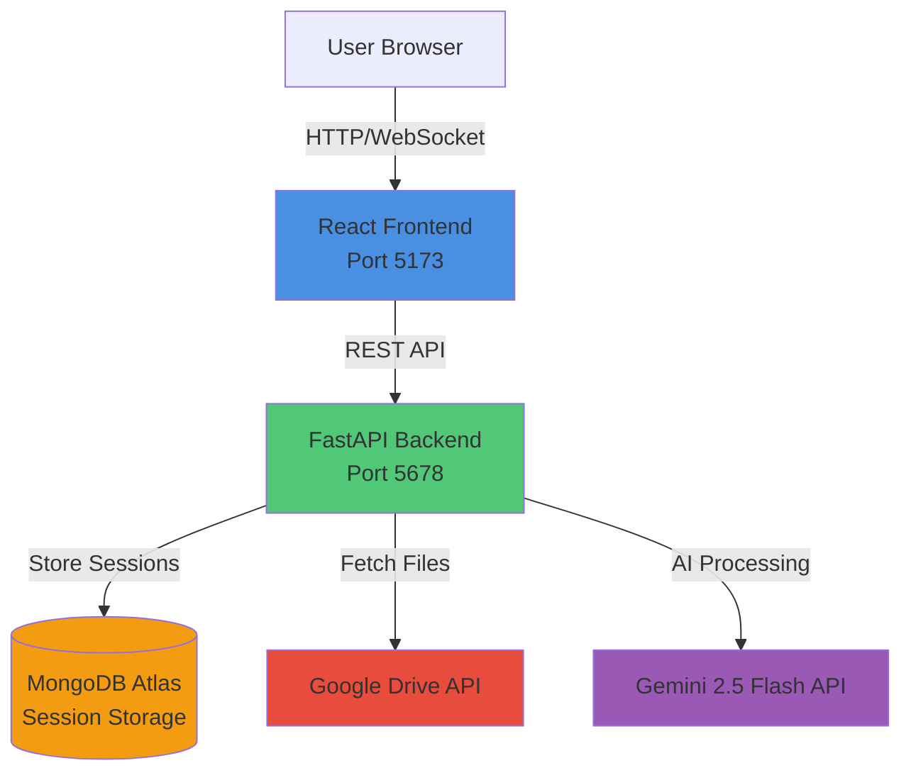
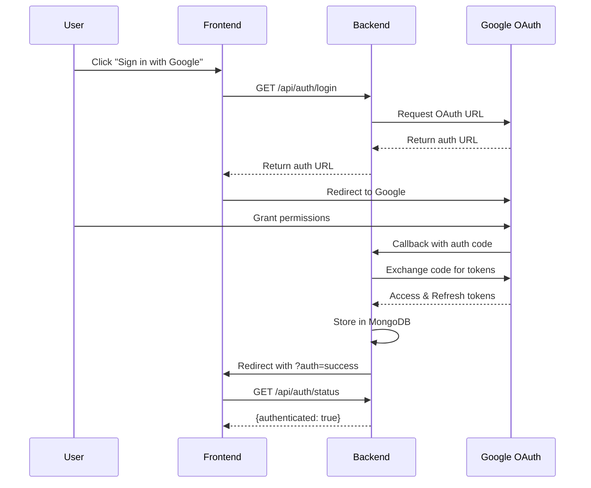
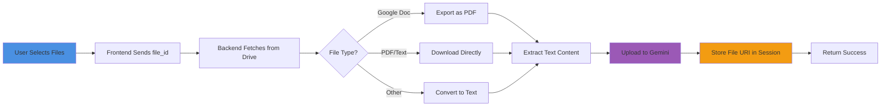
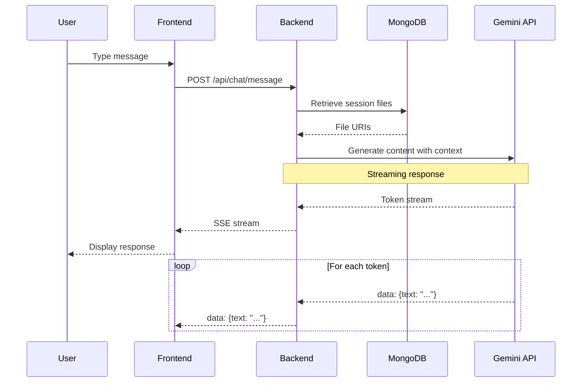
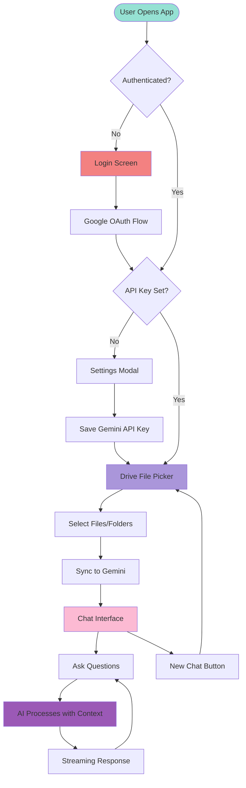

# CIRA - Content Indexing & Retrieval Agent

## Project Overview

CIRA is an intelligent chatbot that enables users to interact with their Google Drive files through natural language conversations. It leverages Google's Gemini AI to provide contextual answers based on the content of selected Drive files.

**Core Value Proposition**: Transform static Google Drive files into an interactive knowledge base accessible through conversational AI.

---

## Architecture

### High-Level Architecture



### Technology Stack

**Client Layer**:
- React 19 with Vite
- Tailwind CSS + Custom Glassmorphism
- Lucide React Icons
- React Markdown

**Server Layer**:
- FastAPI (Python)
- Uvicorn ASGI Server
- Motor (Async MongoDB Driver)
- Google API Client Libraries

**AI & Storage**:
- Google Gemini 2.5 Flash
- MongoDB Atlas (Session Management)
- Google Drive API (File Access)

---

## Core Components

### 1. Authentication System

**OAuth 2.0 Flow**:


**Key Features**:
- Session-based authentication using UUID
- Persistent token storage in MongoDB
- Automatic token refresh handling
- Drive read-only scope access

---

### 2. File Selection & Synchronization

**File Sync Workflow**:


**Supported File Types**:
- Google Docs (exported as PDF)
- PDFs (direct processing)
- Text files (.txt, .md, .json, .xml, .csv)
- Code files (.py, .js, .java, etc.)
- Spreadsheets (exported as CSV)

**File Processing Pipeline**:
1. **Fetch**: Download from Google Drive
2. **Convert**: Transform to processable format
3. **Upload**: Send to Gemini File API
4. **Index**: Store file URI in session context

---

### 3. Conversational AI Engine

**Chat Processing Flow**:


**AI Configuration**:
- **Model**: `gemini-2.5-flash-latest`
- **Temperature**: 0.7 (balanced creativity)
- **Max Tokens**: 8192
- **Tools**: File search (automatic RAG)
- **Safety**: Block harmful content

**Context Management**:
- Files uploaded to Gemini remain in session
- Each message includes file context
- Streaming responses for real-time feedback
- Conversation history maintained client-side

---

## Data Flow

### Complete User Journey



---

## Key Features

### 1. **3-Panel Responsive Layout**
- **Left Sidebar**: Navigation (New Chat, History, Settings)
- **Center Panel**: Drive Picker or Chat Interface
- **Right Sidebar**: File Context Panel (selected files)
- Collapsible panels with state persistence
- Mobile-optimized with slide-over drawers

### 2. **Real-Time File Sync**
- Progress indicators during sync
- Support for multiple file types
- Automatic format conversion
- Error handling with user feedback

### 3. **Streaming Chat Responses**
- Server-Sent Events (SSE) for real-time streaming
- Token-by-token display
- Copy and regenerate message actions
- Markdown rendering with syntax highlighting

### 4. **Session Persistence**
- MongoDB stores user sessions
- OAuth tokens securely saved
- File context maintained across refreshes
- API key encrypted storage

### 5. **Modern UI/UX**
- Apple-inspired design language
- Glassmorphism effects
- Dark/Light theme support
- Smooth animations and transitions

---

## API Endpoints

### Authentication
- `GET /api/auth/login` - Initiate OAuth flow
- `GET /api/auth/callback` - OAuth callback handler
- `GET /api/auth/status` - Check auth status
- `POST /api/auth/apikey` - Save Gemini API key
- `POST /api/auth/logout` - Clear session

### Drive Operations
- `GET /api/drive/files?folder_id={id}` - List folder contents
- `POST /api/drive/sync` - Sync file to Gemini

### Chat
- `POST /api/chat/message` - Send message (SSE response)

---

## Security Considerations

### Authentication & Authorization
- OAuth 2.0 with Google
- Session-based auth with UUIDs
- Read-only Drive access scope
- API keys stored encrypted in MongoDB

### Data Privacy
- No file content stored in database
- Files uploaded to Gemini (temporary)
- Sessions expire after inactivity
- CORS configured for localhost only

### API Security
- Session validation on every request
- Rate limiting (planned)
- Input sanitization
- Error messages don't leak sensitive info

---

## Deployment Architecture

### Development
```
Frontend: http://localhost:5173 (Vite Dev Server)
Backend: http://localhost:5678 (Uvicorn)
Database: MongoDB Atlas (Cloud)
```

### Production (Render.com)
```
Frontend: Static Build (Vite)
Backend: Docker Container (FastAPI)
Database: MongoDB Atlas
Environment: Production secrets via Render
```

**Environment Variables**:
- `GEMINI_API_KEY` - Gemini AI access
- `MONGO_URI` - MongoDB connection string
- `GOOGLE_CLIENT_ID` - OAuth credentials
- `GOOGLE_CLIENT_SECRET` - OAuth credentials

---

## Performance Optimizations

1. **Async Operations**: All I/O operations use async/await
2. **Streaming Responses**: Reduces perceived latency
3. **File Caching**: Gemini caches uploaded files
4. **Lazy Loading**: Components load on demand
5. **Hot Module Replacement**: Fast development iteration

---

## Future Enhancements

- [ ] Conversation history persistence
- [ ] Multi-file chat sessions
- [ ] Export chat transcripts
- [ ] Advanced file filtering
- [ ] Collaborative sessions
- [ ] Voice input/output
- [ ] Mobile native apps
- [ ] Enterprise SSO integration

---

## Project Structure

```
gemini-drive-chatbot/
├── backend/
│   ├── main.py              # FastAPI app & routes
│   ├── requirements.txt     # Python dependencies
│   └── client_secret.json   # OAuth credentials
├── frontend/
│   ├── src/
│   │   ├── components/      # React components
│   │   ├── App.jsx          # Main app component
│   │   ├── config.js        # API configuration
│   │   └── index.css        # Global styles
│   ├── package.json         # Node dependencies
│   └── vite.config.js       # Vite configuration
└── render.yaml              # Deployment config
```

---

## Getting Started

1. **Clone Repository**
2. **Setup Backend**:
   - Install Python dependencies
   - Configure Google OAuth
   - Set environment variables
   - Run: `python -m uvicorn main:app --reload --port 5678`

3. **Setup Frontend**:
   - Install Node dependencies
   - Run: `npm run dev`

4. **Access Application**:
   - Open `http://localhost:5173`
   - Sign in with Google
   - Add Gemini API key
   - Start chatting with your files!

---

**Built with ❤️ using React, FastAPI, and Google Gemini AI**
